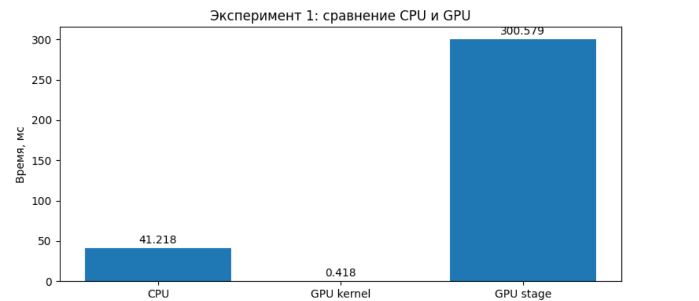
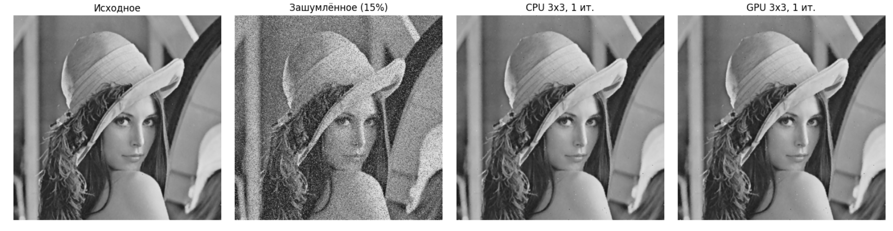
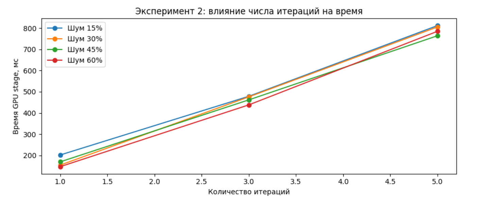
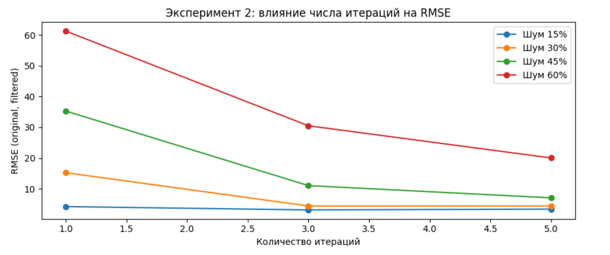
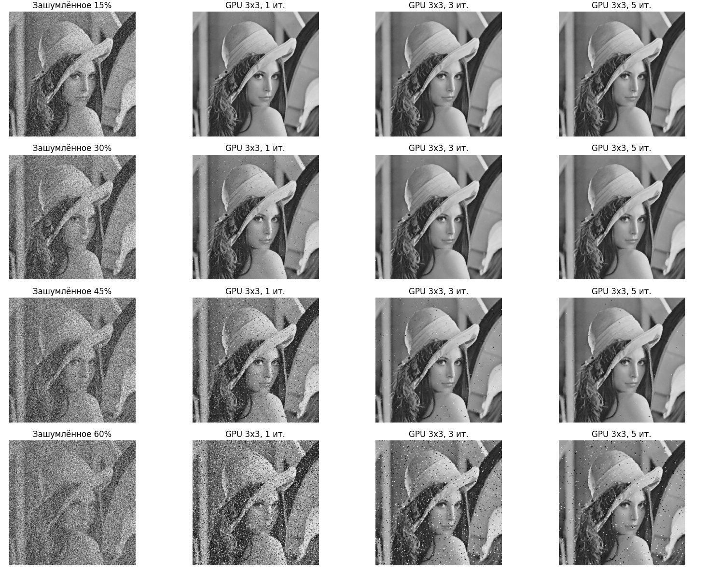

# Лабораторная работа 3. Salt and Pepper

Целью лабораторной работы является реализация фильтрации изображения с шумом типа salt-and-pepper с использованием 9-точечного медианного фильтра на GPU средствами CUDA с обязательным применением texture memory, а также сравнение полученного результата с реализацией на CPU.

1. **Основной эксперимент** — сравнение CPU vs GPU для медианного фильтра 3×3 на одном уровне шума.  
2. **Дополнительный эксперимент** — влияние числа итераций (1, 3, 5) при уровнях шума 15%, 30%, 45%, 60%. GPU-версия использует CUDA texture memory через texture object.

## Описание работы

В данной работе реализована фильтрация изображения с шумом типа **salt-and-pepper** с использованием **9-точечного медианного фильтра 3×3**.  
Реализация выполнена в двух вариантах:

- **на CPU** — последовательная обработка пикселей;
- **на GPU** — параллельная обработка средствами **CUDA** с использованием **texture memory**.

Алгоритм соответствует условию задания:

- входное изображение переводится в **grayscale BMP**;
- для каждого пикселя рассматривается окно **3×3**;
- значения в окне сортируются;
- в выходное изображение записывается медиана;
- для граничных пикселей используются значения ближайших допустимых соседей.

В работе проведены два эксперимента.

### Эксперимент 1 — сравнение CPU и GPU

Для фиксированного уровня шума **15%** выполняется сравнение:

- времени фильтрации на **CPU**;
- времени выполнения **GPU kernel**;
- полного времени **GPU stage**;
- качества результата по **RMSE**;
- визуального результата после фильтрации.

### Эксперимент 2 — влияние количества итераций

Для уровней шума **15%, 30%, 45%, 60%** исследуется влияние числа итераций фильтрации (**1, 3, 5**) на:

- время обработки;
- качество восстановления изображения;
- визуальный результат.

---

## Графики и изображения

### Эксперимент 1

#### 1. Сравнение времени CPU и GPU

На графике показаны три метрики: `CPU`, `GPU kernel` и `GPU stage`.

       **Рисунок 1 — Сравнение времени выполнения медианного фильтра 3×3 на CPU и GPU.**  

#### 2. Визуальное сравнение изображений для эксперимента 1

**Рисунок 2 — Визуальное сравнение исходного, зашумлённого и отфильтрованных изображений (CPU и GPU) при уровне шума 15%.**
### Эксперимент 2

#### 3. Влияние числа итераций на время

**Рисунок 3 — Влияние количества итераций медианного фильтра 3×3 на время обработки при различных уровнях шума.**

#### 4. Влияние числа итераций на RMSE

**Рисунок 4 — Влияние количества итераций медианного фильтра 3×3 на RMSE при различных уровнях шума.**

#### 5. Визуальное сравнение результатов при разных уровнях шума и числе итераций

**Рисунок 5 — Визуальное сравнение результатов фильтрации при уровнях шума 15%, 30%, 45% и 60% для 1, 3 и 5 итераций.**

---

## Результаты

### Результаты эксперимента 1

В первом эксперименте было выполнено сравнение реализации медианного фильтра 3×3 на CPU и GPU при фиксированном уровне шума 15%. Результаты показали, что время выполнения CUDA-ядра (**GPU kernel = 0.426 мс**) значительно меньше времени обработки на CPU (**45.043 мс**). Это подтверждает, что вычислительная часть медианного фильтра эффективно распараллеливается и гораздо быстрее выполняется на GPU.

При этом полное время **GPU stage** составило **170.133 мс**, что оказалось больше времени CPU. Это связано с тем, что в **GPU stage** входят не только вычисления, но и накладные расходы: выделение памяти на устройстве, копирование данных между CPU и GPU, создание `texture object` и копирование результата обратно. Таким образом, GPU обеспечивает ускорение именно для чистого вычисления, однако суммарное время обработки зависит также от служебных операций.

Визуальное сравнение изображений показало, что результаты фильтрации на CPU и GPU практически совпадают. Оба варианта существенно уменьшают количество импульсного шума, сохраняя при этом основную структуру изображения. Следовательно, GPU-реализация работает корректно и даёт тот же качественный результат, что и CPU-реализация, но значительно выигрывает по скорости выполнения самого алгоритма.

### Результаты эксперимента 2

#### Выводы по эксперименту 2

**С увеличением числа итераций время обработки растёт почти линейно.**  
На графике времени видно, что переход от 1 к 3 и затем к 5 итерациям во всех случаях увеличивает **GPU stage**. Это логично, потому что фильтр запускается несколько раз подряд.

**Число итераций влияет на качество сильнее, чем на него влияет само время.**  
По графику **RMSE** видно, что при увеличении числа итераций ошибка уменьшается, то есть результат становится ближе к исходному изображению.

**При слабом шуме дополнительные итерации почти не нужны.**  
Для уровня шума **15%** уже после первой итерации изображение восстанавливается очень хорошо, а дальнейшее увеличение числа итераций даёт лишь небольшое улучшение.

**При среднем и сильном шуме дополнительные итерации действительно полезны.**  
Для **30%** и особенно **45%** шума переход от 1 итерации к 3 и 5 заметно уменьшает RMSE и визуально делает изображение чище.

**При очень сильном шуме фильтр улучшает изображение, но полностью восстановить его уже не может.**  
Для **60%** шума даже после 5 итераций RMSE остаётся высокой, а на изображении всё ещё заметны артефакты. Это значит, что возможности медианного фильтра 3×3 при таком уровне искажения ограничены.

**Визуальный анализ подтверждает графики.**  
На изображениях видно, что:

- при **15%** шум почти полностью подавляется;
- при **30%** результат после **3–5 итераций** уже очень хороший;
- при **45%** шум заметно уменьшается, но часть дефектов остаётся;
- при **60%** фильтр улучшает изображение, но восстановление остаётся неполным.

### Короткий общий вывод по дополнительному эксперименту

Дополнительный эксперимент показал, что увеличение числа итераций медианного фильтра 3×3 улучшает качество восстановления изображения, особенно при высоком уровне шума, однако одновременно увеличивает время обработки. При умеренном уровне шума одной итерации чаще всего достаточно, а при сильном шуме требуется несколько итераций, хотя даже они не всегда позволяют полностью восстановить исходное изображение.

---

## Вывод

В работе был реализован **9-точечный медианный фильтр 3×3** для удаления шума типа **salt-and-pepper** на **CPU** и **GPU**. GPU-реализация выполнена средствами **CUDA** с использованием **texture memory**, что соответствует условию задания.

Результаты первого эксперимента показали, что вычислительная часть алгоритма значительно быстрее выполняется на GPU, чем на CPU, что подтверждается малым временем `GPU kernel`. При этом полное время `GPU stage` оказалось больше времени CPU из-за накладных расходов на передачу данных и подготовку ресурсов на стороне GPU.

Дополнительный эксперимент показал, что эффективность фильтра зависит как от уровня шума, так и от числа итераций. При умеренном шуме одной итерации достаточно для хорошего результата, а при сильном шуме увеличение количества итераций уменьшает ошибку восстановления, хотя полностью восстановить изображение при очень сильном шуме уже затруднительно.

Таким образом, поставленная задача выполнена: реализован медианный фильтр 3×3 на CUDA с использованием texture memory, получены результирующие изображения в формате BMP и исследовано влияние уровня шума и числа итераций на качество и время фильтрации.
